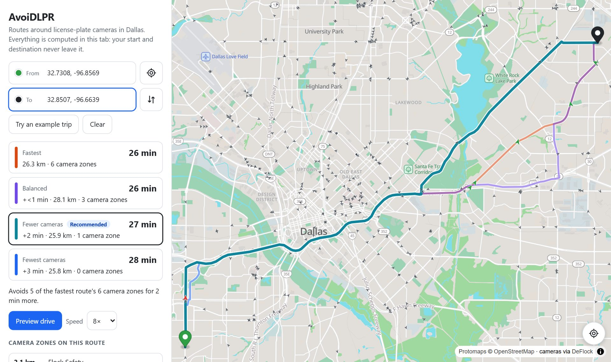
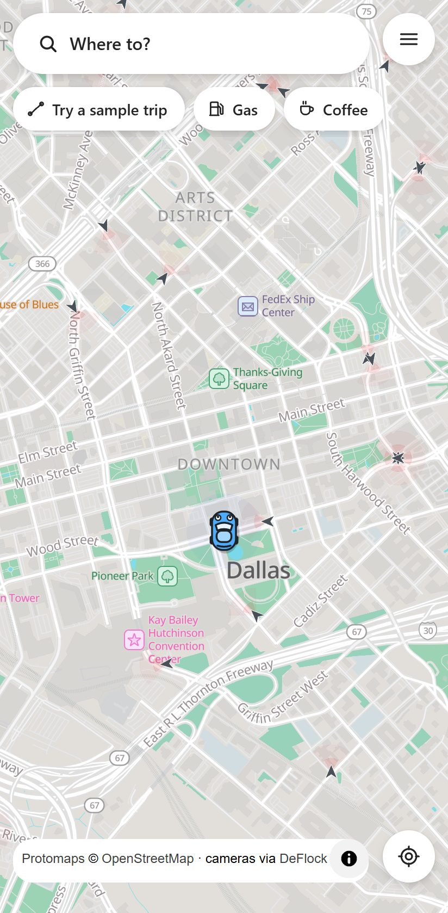
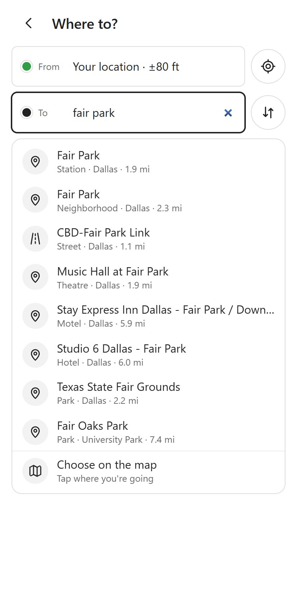
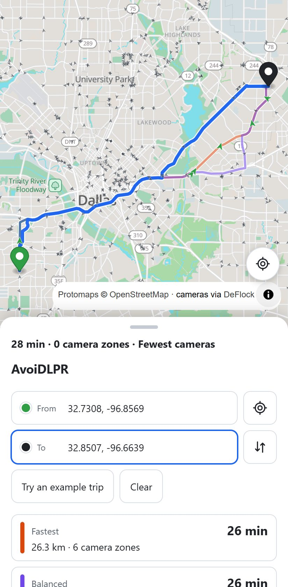
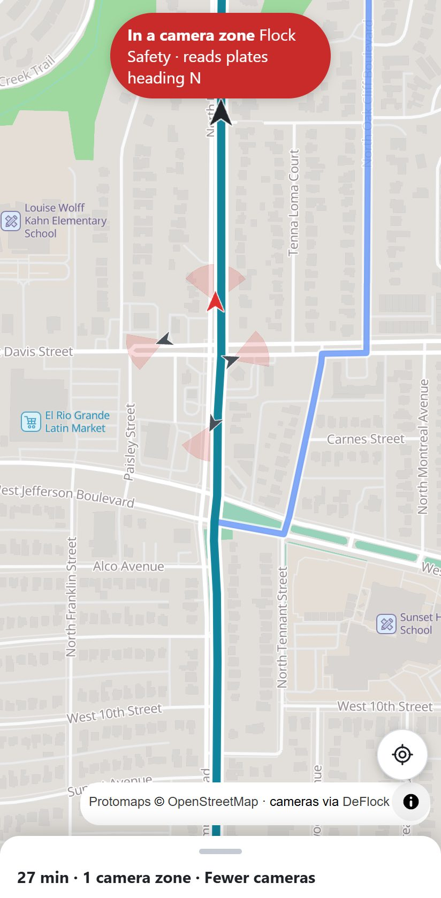

# AvoiDLPR

**Driving directions that steer around license plate cameras.**

AvoiDLPR is a free map app that knows where automated license plate readers (ALPRs) are,
Flock Safety cameras included. It finds routes that pass as few of them as possible, shows you
what each route costs in cameras and in minutes, and warns you as you drive. It runs in your
phone's browser, installs to your home screen like an app, and never sends your location, your
destination or your searches anywhere.

  

> **Status:** built for 135 US metro areas, from New York to Los Angeles and Charlotte to
> Seattle, but not public yet. The link will go here when it's live.

## Why

A license plate reader photographs every car that passes, not just the cars police are looking
for, and logs the plate, the time and the place. Flock Safety's cameras, now in thousands of US
communities, also record each car's make, color and features like roof racks and bumper
stickers. They're networked too, so police in one town can search cameras across the country.
In 2025, [records obtained by 404 Media](https://www.404media.co/ice-taps-into-nationwide-ai-enabled-camera-network-data-shows/)
showed more than 4,000 searches of Flock's national network for immigration enforcement over a
single year, and later reporting found
[searches tied to abortion cases](https://www.404media.co/flock-removes-states-from-national-lookup-tool-after-ice-and-abortion-searches-revealed/).

Put enough of these cameras on enough corners and they add up to a record of where everyone
drives. You can't opt out of being photographed, but you can choose which roads you take.
AvoiDLPR makes that choice easy to see. The [EFF's guide to ALPRs](https://www.eff.org/issues/automated-license-plate-readers-alpr)
is a good place to learn more.

## How it works

  
  &nbsp;
  
  &nbsp;
  
  &nbsp;
  

1. **A map of the cameras.** Volunteers map ALPRs on OpenStreetMap through
   [DeFlock](https://deflock.org), including each camera's brand and which way it points.
   AvoiDLPR picks up their map every hour.
2. **Camera zones.** A camera reads plates on the stretch of road in front of it. Flock
   cameras read rear plates, so they only log cars driving away from them, in one direction.
   When the map says which way a camera points, AvoiDLPR only counts it against routes that
   drive through its view in that direction. When it doesn't, AvoiDLPR assumes the camera can
   see every road around it. Around each zone, a wider, fainter ring marks where a camera may
   still see you: some models reach further than the one Flock publishes a range for, and
   oncoming cars show their fronts. Routes go around rings when that costs almost nothing, and
   the app tells you when you're in one.
3. **Route options.** For each trip you get the fastest route plus up to three others that
   trade a few minutes for fewer camera zones, each labelled with its time, its number of
   zones and how many cameras it passes near. The one marked *Recommended* avoids the most zones while adding no more than about
   10% to the trip. You pick.
4. **Drive.** Tap **Start** and AvoiDLPR follows your phone's GPS along the route: a warning
   before each camera zone, a banner and a chime while you're in one, and a new route if you
   leave this one. Keep the app open with the screen on; phones pause web apps in the
   background. (**Preview** plays the trip back on the map in about 30 seconds, to see where
   the zones are.)

The map covers the whole lower 48, and routing works in 135 metro areas, one at a time. Zoom in on
yours, search for it by name, or tap the locate button, and that area's road map and its list of
addresses and places download, a few megabytes. To plan a trip, type where you're going (an
address, a street, or a place like a store, a stadium or the airport) or hold your finger on the
spot on the map (right-click on a computer) and choose **Directions to here**. Start from your
current location or anywhere else. A plain tap on the map doesn't change your trip, so panning
around can't move it by accident.

It works like the map apps you already know: **Where to?**, pick a route, **Start**. It follows
your phone's light or dark mode (or pick one in the menu), and you're the little car on the map:
a hatchback, pickup, van or scooter, your choice.

## Your privacy

- **Routing happens on your phone.** The app downloads your area's road map and camera list
  once, then works out every route on the device. Your location, start and destination are
  never sent anywhere. There's no AvoiDLPR server to send them to.
- **So does search.** Most map apps send everything you type to their servers. AvoiDLPR
  downloads your area's addresses and places once and looks them up on your phone, so what you
  search for stays there too.
- **No account, no ads, no analytics.** The app remembers your area, your ride and light or
  dark, on your device.
- Like any online map, it downloads map images for the area on screen. Those come from
  AvoiDLPR's own file host (not Google or Apple) and carry no account or identifier.
- After the first visit, route planning and search work offline too.

## Help improve the camera map

The map is only as good as the volunteers who build it, and plenty of cameras aren't on it yet.
If you know of one that's missing, or one that's wrong, add or fix it on
[DeFlock](https://deflock.org). AvoiDLPR picks up the change within the hour after DeFlock
publishes it. In the app, hold the spot on the map and choose **Add a camera here**: it opens
OpenStreetMap's editor right there (DeFlock's map is built from OpenStreetMap, and DeFlock has
[a guide](https://deflock.org/report/id)). **Report a map problem here** leaves a note for
mappers, about a missing address, say, with no account needed. Every camera in the app links to
its OpenStreetMap entry.

## Questions

**Is this legal?** Choosing your route is. AvoiDLPR doesn't interfere with cameras and doesn't
hide your plate. Don't cover or alter your plate either: that's illegal in most states, and it
doesn't help, because Flock also logs each car's make, model, color and features like roof racks
and bumper stickers.

**Does "0 camera zones" mean nobody saw me?** No. It means the route passes no *mapped*
cameras. Many cameras aren't mapped yet, and readers mounted on police cars move around.

**How far away can a camera see me?** Flock says its standard camera reads plates up to about 75
feet away. AvoiDLPR's zones reach about twice that, allowing for cameras mapped a little off their
real spot, and each has a ring beyond it where a camera may still see you. Flock also sells
long-range and zoom cameras with no published range, and the camera map doesn't say which model is
which, so the rings matter.

**Why does the recommended route still pass a camera?** Sometimes there's no reasonable way
around one. AvoiDLPR shows you the options and lets you decide.

**Is AvoiDLPR part of Flock Safety or DeFlock?** No. It's an independent project that uses
DeFlock's public camera map.

**How current is the map?** Cameras update hourly. Roads are checked every night: an area's road
map is replaced when its roads changed noticeably, or weekly for small fixes, so your phone isn't
downloading it again for every one-street edit. The menu shows their dates.
Addresses and places, for search, are rebuilt monthly.

**Why can't it find an address?** Search knows the addresses and places on OpenStreetMap, which
has every house number in some towns and few in others. When a number isn't mapped but its
neighbors are, AvoiDLPR places it between them and marks it *Approximate*. Otherwise it offers
the street, and you can always tap the exact spot on the map. Anyone can
[add missing addresses and places](https://www.openstreetmap.org/fixthemap) to OpenStreetMap,
and AvoiDLPR picks them up within a month.

**Does it work outside the US?** Not yet. Nothing about the approach is US-specific, so it can
cover anywhere the cameras are mapped.

## Coming next

- Trips between areas, and the rest of the country outside the metros
- Reporting a camera from inside the app
- Plugins that bring camera zones to open-source navigation apps

## For developers

AvoiDLPR is a static website plus static data files: no server, no database. A Python pipeline
turns OpenStreetMap and DeFlock data into a compact road file and a search index for each city,
and one map of the whole country.
The app is TypeScript: MapLibre GL with a self-hosted Protomaps basemap, and its own router and
search, which run in Web Workers on your phone. The code still uses the project's working name,
FlockWatch.

- [docs/DEVELOPING.md](docs/DEVELOPING.md): building, testing and adding a city
- [docs/DEPLOY.md](docs/DEPLOY.md): hosting it for free (Cloudflare Workers and R2, GitHub Actions)
- [spike/routing/ROUTING.md](spike/routing/ROUTING.md): the camera-zone model and the routing
  math
- [spike/FINDINGS.md](spike/FINDINGS.md): where the camera data comes from and how good it is

Issues and pull requests are welcome.

## License

The code is licensed under the [Apache License 2.0](LICENSE).

The map data is not. Roads and camera locations come from OpenStreetMap under the
[Open Database License](https://opendatacommons.org/licenses/odbl/) (© OpenStreetMap
contributors), and the road packs, search indexes and camera feeds this project builds from them
carry the same license. The basemap tiles are a Protomaps build of OpenStreetMap (also ODbL), the label fonts
are Noto Sans (SIL Open Font License), and MapLibre GL JS, PMTiles and the Protomaps style are
BSD-3-Clause.

AvoiDLPR isn't affiliated with Flock Safety. Flock Safety is a trademark of its owner.
