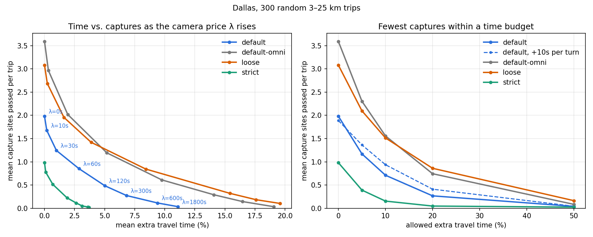
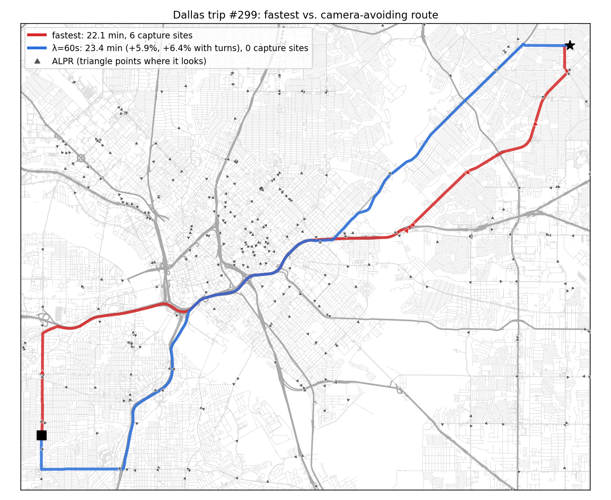

# Routing spike (2026-10-02)

**Questions.** Can a router meaningfully avoid ALPR capture zones? What does it cost in time?
Which engine can carry it?

**Answer (Dallas, 300 random 3–25 km trips, default model).** The fastest routes pass about **1
capture site per 10 km**. Allowing **+10% travel time** cuts captures by **64%** (53% after
charging 10 s per extra turn) and makes **55%** of trips capture-free. Allowing **+20%** cuts them
by **87%**. The only option that does everything we need (one-way capture, a per-request time
budget, private routing) is our own router running **on the device**. Its measured cost:
**~31 ms per query and ~7 MB per metro**.



## 1. Capture model: one predicate for routing *and* alerts

Flock's published spec: a camera reads **rear plates** of **one travel direction**, ~1.5 lanes,
up to **~75 ft (23 m)**, with a field of view ~15–20 ft wide at 65 ft (half-angle ≈ 9°).
OSM `direction` is the way the lens points. So a north-facing Flock camera logs vehicles
**driving north, away from it**. *(Correction to the earlier scoping note, which had it backwards.)*

A camera is a set of sectors (apex = mapped pole, compass bearing θ, half-angle α, range R). In
local metres (equirectangular about a reference latitude; error ≈ tan φ₀·Δφ, about 0.2% across a metro):

- **Distance to a sector** (exact; tested against shapely to < 1 mm). Let *d* = |p| and δ = the
  angle of p off θ.
  - If δ ≤ α: dist = max(0, d − R).
  - Otherwise, with φ = δ − α and s = d·cos φ: dist = d if s ≤ 0; d·sin φ if 0 < s < R;
    √(d² + R² − 2dR·cos φ) if s ≥ R.
- **Captured** ⇔ dist(p, sector) ≤ ε **and** the heading test passes:
  - `rear` (Flock): |h − θ| ≤ β
  - `axis` (other brands; plate side unknown): within β of θ or θ + 180°
  - `any` (direction unknown): the sector becomes a disk.

  ε absorbs pole-position error and the lane-to-centreline offset.

| Profile | R | α | ε | β | Rationale |
|---|---|---|---|---|---|
| strict | 25 m | 15° | 8 m | 30° | ≈ spec |
| default | 50 m | 30° | 12 m | 45° | spec padded for OSM pole/bearing error |
| loose | 100 m | 45° | 20 m | 60° | upper bound |

**Capture sites.** Cameras within 25 m of each other (poles, per-lane gantries) form one *site*.
Passing a site logs you once, so the site is the privacy unit. Dallas: 1,408 cameras inside the
extract → 1,318 sites.

The same `captures(cam, position, heading)` drives live alerts (GPS fix + heading) and routing
(road samples every 5 m), so the two can never disagree. Code:
[geometry.py](geometry.py).

**Rings: where a camera may still see you** (added in the app, October 2026). The spec above is
Flock's standard camera. The same company sells long-range, wide-range and zoom (PTZ) cameras
with no published range, and DeFlock's data doesn't say which model a camera is (its tags are
direction, manufacturer and operator). Flock also logs a car's make, model, colour, body type and
features like roof racks and stickers, plate or no plate ("Vehicle Fingerprint"), so an
oncoming car's front can be logged even in a state without front plates. So each zone gets a
**ring**: the next profile's sector (strict → default → loose → 150 m, 60°, 25 m, 75°) and the
`axis` heading test for every brand, Flock included.

- A ring is priced at **w = ¼ of a capture**: entering a zone and its ring costs 1 (the ring w,
  the zone 1 − w), a ring alone costs w. So a route only detours round a ring when that's nearly
  free (at λ = 60 s, a 15 s detour), and the options frontier is on the score
  D(P) + w·(rings passed without their zone).
- Rings are kept apart from zones in the search (their sites are numbered after the zones'), so a
  zone and its ring never stand in for each other at an intersection.
- The app draws rings fainter than zones and says "Near a camera" while in one: after "In a
  camera zone", before "Camera ahead", and never for a camera whose zone the route enters.
- On the Dallas example trip, the fewest-cameras option goes from 28 min with no zones to 29
  min with no zones and no rings; search time is about the same (8 probes against 7).

Code: `RINGS` and `RING_WEIGHT` in `packages/router/src/geo.ts`, `withRings` in
`packages/router/src/exposure.ts`.

## 2. Routing formulation

Each directed edge *e* carries a travel time tₑ and an exposure

  xₑ = Σ over sites *s* of min(1, captured_length(e, s) / L_ref(s)), with L_ref = R + 2ε (one straight pass through the zone).

Route cost is W(P) = T(P) + λ·X(P), where λ is **seconds of driving one avoided capture is worth**.

- **Why length-normalised.** The obvious per-edge "camera count" is not additive along a path. A
  zone that straddles an intersection gets counted on both edges. Normalising by pass length makes
  one pass ≈ 1 however the graph splits it, so plain Dijkstra stays exact for W. The exact
  alternative counts *entries* into each zone. That needs an edge-based (turn-expanded) graph,
  which we'll want anyway for turn restrictions.
- **Evaluation** uses D(P), the exact number of distinct sites that log the route, not X.
- **Sweeping λ** finds the *supported* points of each trip's (T, D) Pareto frontier.
- **Product framing.** The user-facing control should be a **time budget** ("fewest captures
  within +N min"). That is a resource-constrained shortest path, solved by Lagrangian relaxation:
  bisect on λ, one Dijkstra per probe, ~6–8 probes (LARAC). Weighted sums can miss
  non-supported Pareto points; acceptable here.
- **One-way capture makes routing asymmetric.** A→B and B→A avoid different streets.

Code: [exposure.py](exposure.py) (per-edge exposure), [experiment.py](experiment.py) (sweep).

## 3. Results

Dallas BBBike extract: 214,570 nodes, 515,955 directed edges, 24,758 km of road; 1,626 cameras
in the graph bbox. Trips average 20.2 km and 15.2 min on the fastest route.

**Fastest routes (λ = 0).**

| Model | Sites per trip | Per 10 km | Capture-free trips |
|---|---|---|---|
| strict | 0.98 | 0.49 | 41% |
| **default** | **1.98** | **0.98** | **18%** |
| loose | 3.08 | 1.53 | 10% |
| default, heading ignored | 3.59 | 1.78 | 6% |

**Fewest captures within a time budget (default model).**

| Allowed extra time | Sites per trip | Cut vs. fastest | Capture-free | Cut, +10 s per turn |
|---|---|---|---|---|
| +0% | 1.98 | – | 18% | – |
| +5% | 1.17 | 41% | 36% | 31% |
| **+10%** | **0.71** | **64%** | **55%** | **53%** |
| +20% | 0.27 | 87% | 78% | 79% |
| +50% | 0.04 | 98% | 96% | 98% |



In the example trip, the fastest route takes 22.1 min and passes 6 sites. At λ = 60 s the route
takes 23.4 min (+5.9%, +6.4% with turns) and passes 0 sites.

**What the numbers say.**
1. **Directionality is not a detail.** Ignoring heading overstates exposure by 81% (3.59 vs. 1.98
   sites per trip) and almost doubles the cost of avoiding it (+10% budget: 1.56 vs. 0.71 sites).
   Alerts and routing both need the heading test.
2. **Cameras sit on arterials**, by design: they watch traffic flows. Exposed road is only 343
   directed-km of 43,086 (0.8%), but fastest routes favour exactly those arterials. Avoidance works by
   shifting to parallel collectors, at ~+2.5 turns per trip at λ = 300.
3. **The knee is around λ = 60–120 s.** That buys a 57–76% cut for 3–5% more time (4–7% with turn
   costs). A sensible default for an "avoid cameras" toggle.
4. **Model uncertainty brackets the result; it doesn't overturn it.** Even the loose model cuts
   captures 51% within +10%.
5. **Mapped data mostly fits the model.** 96% of sites inside the extract log a drivable road under
   the default model, but only 74% under strict. Strict is too narrow for hand-mapped bearings,
   which is why default pads it. Of the 1,408 cameras inside the extract, the median one sits
   6.5 m from a road centreline, and only 4 are farther than 62 m from any routable road (parking
   lots). Another 55 (3.9%) have a road in reach but none in a captured heading; 41 of those match
   a road if heading is ignored. That makes them likely bearing errors: a ready-made "please
   re-check this camera" queue for the reporting flow ([orphans.py](orphans.py)).

## 4. Engines

| | Soft penalty | One-way penalty | Per-request λ / budget | Thousands of zones | Verdict |
|---|---|---|---|---|---|
| **Own router** (this spike) | ✓ | ✓ | ✓ | ✓ precomputed per edge | **PoC + privacy story** |
| OSRM | ✓ weight is separate from duration (honest ETA); `process_segment` can look up external data by segment coordinates; segment-speed files via `osrm-customize` | likely (segment updates are keyed by from→to node pairs), to verify | ✗ one preprocessed profile per avoidance level | ✓ baked in, hourly customize | server/native scale-out |
| GraphHopper | ✓ custom-model `priority` (multiplicative per edge, so proportional to edge length) | only with an import-time custom encoded value (Java) | ✓ per-request custom models | per-request areas don't scale; maintainers recommend import-time custom areas | possible, more work |
| Valhalla | ✗ `exclude_polygons` is hard exclusion; soft `cost_polygons` is an open proposal (valhalla#5268, #5699) | ✗ | – | capped total exclude-polygon perimeter | not today |
| BRouter | ✓ weighted no-go areas (circles, polygons, polylines) | ✗ no-gos block both directions | ✓ per request | untested | **OsmAnd/Locus plugin path** |

## 5. Recommendation

1. **Web PoC: our own router, on the device, per metro.** It is the only option that is
   one-way-aware, supports a live time-budget slider, and keeps origin and destination off any
   server. The latter is the product's core promise to a privacy-minded audience. Measured: 31 ms per
   full single-source Dijkstra over 215k nodes (scipy). The Dallas pack is 3.3 MB of routing core
   plus 4.0 MB of route geometry, gzipped, with naive encoding. The browser build needs an
   edge-based graph (turn restrictions and costs), bidirectional A*, and later contraction
   hierarchies for state-scale trips.
2. **Scale-out: OSRM** with 2–3 baked avoidance levels and hourly `osrm-customize`, for a native
   app or long trips. It's the next spike, since Docker is available here.
3. **Existing apps: BRouter weighted no-gos** for OsmAnd and Locus users, accepting that it
   penalises both directions. Ship it alongside the regional data feed.

## 6. Caveats

- **Free-flow speeds.** No signals or congestion, and no OSM turn restrictions (node-based graph).
  The flat 10 s per turn re-score is a sanity check, not a turn model.
- **Accuracy of the mapped data.** Bearings and pole positions are unverified. The heading
  tolerance and ε are guesses bracketed by the profiles.
- **Plate side for non-Flock brands** is undocumented, so they're modelled as either direction.
  In Dallas they're only 4% of cameras, but they matter more elsewhere (e.g. Chicago).
- **The site rule is crude.** 25 m single-linkage could merge separate approaches at one
  intersection.
- **One metro, random trips.** Real trip distributions (commutes) and denser or sparser metros
  will differ.

## Reproduce

```bash
python -m venv --system-site-packages .venv && .venv/Scripts/pip install osmium shapely
curl -L -o spike/routing/data/Dallas.osm.pbf https://download.bbbike.org/osm/bbbike/Dallas/Dallas.osm.pbf
cd spike/routing && ../../.venv/Scripts/python build_graph.py data/Dallas.osm.pbf
../../.venv/Scripts/python experiment.py     # ~80 s; writes figures/ and data/results.csv
../../.venv/Scripts/python -m pytest -q      # 32 tests
```

Camera data comes from `spike/regions/` (the DeFlock tiles; see [../FINDINGS.md](../FINDINGS.md)).
